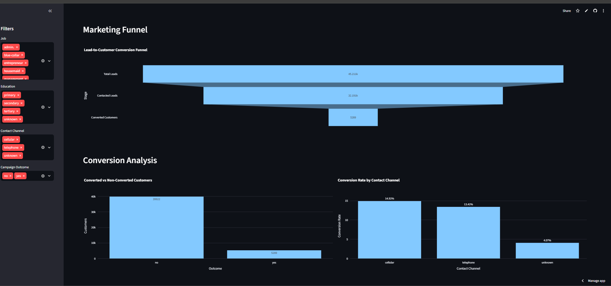
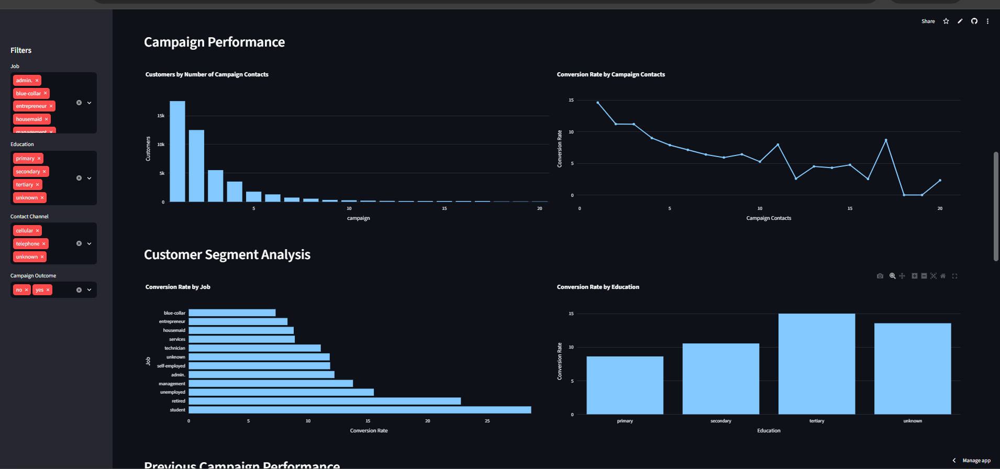
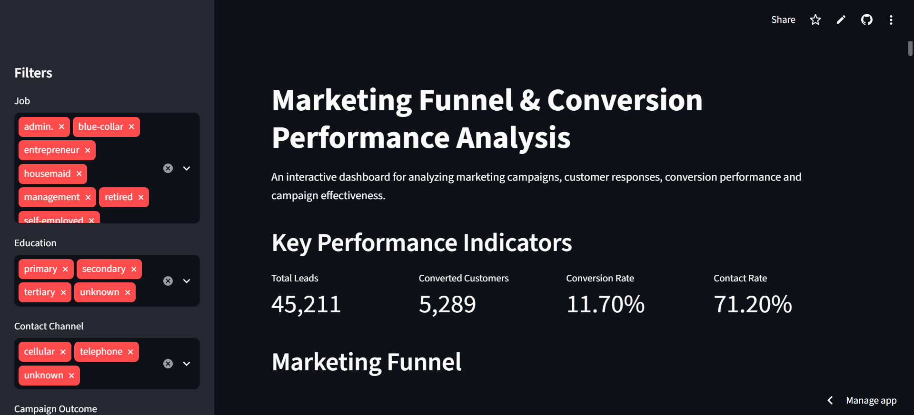

# Marketing Funnel & Conversion Performance Analysis

An interactive data analytics project focused on analyzing marketing funnel performance, customer conversion patterns, campaign effectiveness, customer behavior, and opportunities to improve lead-to-customer conversion.

This project uses Python, Pandas, NumPy, Matplotlib, Seaborn, Plotly, and Streamlit to transform marketing data into meaningful business insights through data cleaning, exploratory analysis, conversion metrics, interactive visualizations, funnel analysis, campaign analysis, and actionable recommendations.

---

## Project Links

GitHub Repository:

https://github.com/Naina137/Marketing-Funnel-and-Conversion-Performance-Analysis

Live Streamlit Dashboard:

https://marketing-funnel-and-conversion-performance-analysis-ymxdoixnv.streamlit.app/

---

## Project Overview

Marketing funnel analysis helps businesses understand how potential customers move through different stages of the customer journey and where opportunities are lost before conversion.

This project analyzes the Bank Marketing Dataset to understand customer responses, campaign performance, conversion behavior, marketing channels, customer segments, and potential conversion drop-offs.

The final result is an interactive Streamlit dashboard that presents the analysis through performance metrics, funnel visualization, campaign analysis, customer segmentation, conversion analysis, key insights, and business recommendations.

---

## Task 3: Marketing Funnel & Conversion Performance Analysis

### Task Objective

The objective of this task is to analyze marketing funnel data and identify:

- Conversion drop-off points
- Funnel performance
- Campaign performance
- Customer response patterns
- Conversion-related factors
- High-performing and low-performing customer segments
- Opportunities to improve lead-to-customer conversion

The final deliverable is an interactive marketing funnel dashboard containing conversion analysis, performance insights, drop-off analysis, and actionable business recommendations.

---

## Problem Statement

Businesses generate large amounts of customer and marketing data, but raw data does not directly provide clear business direction.

This project focuses on answering important business questions such as:

- Where are customers dropping out of the marketing funnel?
- Which marketing channels perform better?
- How does campaign frequency relate to conversion?
- Which customer groups show stronger conversion potential?
- What patterns are associated with successful customer responses?
- How can marketing campaigns be optimized to improve conversion?

---

## Objectives

The main objectives of this project are:

- Analyze marketing funnel performance
- Calculate important conversion metrics
- Identify customer conversion patterns
- Analyze campaign performance
- Compare contact channel performance
- Study customer segments and their conversion behavior
- Analyze previous campaign outcomes
- Identify potential funnel drop-offs
- Generate meaningful business insights
- Provide actionable recommendations for improving conversion performance

---

## Key Features

- Interactive marketing funnel analysis
- Conversion performance analysis
- Campaign performance analysis
- Customer segment analysis
- Contact channel analysis
- Previous campaign analysis
- Funnel drop-off identification
- Key performance indicators
- Interactive data visualizations
- Business insights
- Actionable recommendations
- Streamlit dashboard
- Data exploration
- Downloadable analyzed data
- Easy-to-use analytical interface

---

## Technologies Used

| Technology | Purpose |
|------------|---------|
| Python | Data analysis and application development |
| Pandas | Data cleaning, transformation and analysis |
| NumPy | Numerical operations |
| Matplotlib | Data visualization |
| Seaborn | Statistical visualization |
| Plotly | Interactive data visualization |
| Streamlit | Interactive dashboard development |
| Git | Version control |
| GitHub | Repository and project hosting |

---

## Dataset

This project uses the Bank Marketing Dataset, primarily the `bank-full.csv` dataset.

The dataset contains customer and marketing campaign information used to understand customer characteristics, campaign interactions, contact methods, previous campaign outcomes, and customer responses.

The data is processed using Python and Pandas before performing the analysis and generating dashboard visualizations.

### Dataset Information

The dataset contains variables related to:

- Customer demographics
- Job and education
- Marital status
- Financial characteristics
- Housing and personal loans
- Contact method
- Campaign contacts
- Previous campaign outcomes
- Customer response

### Dataset Files

- `bank-full.csv`
- `bank.csv`
- `bank-names.txt`

---

## Data Preparation

The data analysis workflow includes:

1. Loading the Bank Marketing dataset
2. Inspecting the dataset structure and columns
3. Removing duplicate records
4. Cleaning categorical variables
5. Preparing data for analysis
6. Creating conversion-related metrics
7. Calculating funnel performance
8. Analyzing campaign and customer segments
9. Creating interactive visualizations
10. Identifying key business insights
11. Generating actionable recommendations
12. Presenting the results through Streamlit

---

## Analysis Performed

### 1. Marketing Funnel Analysis

The marketing funnel analysis examines the customer journey from the overall customer population through contact and eventual conversion.

The analysis helps identify:

- Total customers
- Contacted customers
- Converted customers
- Conversion rate
- Funnel progression
- Potential conversion drop-offs

### 2. Conversion Analysis

Conversion analysis evaluates customer outcomes and identifies patterns associated with successful conversion.

The analysis includes:

- Converted versus non-converted customers
- Overall conversion rate
- Conversion rate by contact channel
- Conversion rate by customer segment
- Conversion rate by education
- Conversion rate by previous campaign outcome

### 3. Campaign Performance Analysis

Campaign-related variables are analyzed to understand how campaign activity relates to customer responses.

The analysis includes:

- Number of campaign contacts
- Customer distribution by campaign contacts
- Conversion rate by campaign contacts
- Previous campaign outcomes
- Relationship between previous campaign outcomes and current conversion

### 4. Customer Segment Analysis

Customer characteristics and behavioral patterns are analyzed to identify meaningful customer segments.

The analysis includes:

- Job
- Education
- Age
- Marital status
- Housing loan status
- Personal loan status
- Customer response

This analysis can help businesses develop more targeted marketing strategies.

### 5. Contact Channel Analysis

Different contact channels are compared to understand their relative conversion performance.

The analysis helps identify:

- Customer distribution by contact channel
- Conversion rate by channel
- Better-performing communication channels
- Opportunities for channel optimization

### 6. Previous Campaign Analysis

Previous campaign outcomes are analyzed to understand whether historical customer responses provide useful information for future marketing decisions.

This analysis compares previous campaign outcomes with current customer conversion and helps identify potentially high-potential customer groups.

---

## Key Performance Indicators

The dashboard provides important marketing performance metrics such as:

- Total Leads
- Contacted Customers
- Converted Customers
- Conversion Rate
- Contact Rate
- Campaign Performance
- Customer Response

These KPIs provide a quick overview of marketing funnel performance and help identify areas that require attention.

---

## Dashboard Features

The Streamlit dashboard provides an interactive interface for exploring marketing funnel and conversion performance.

The dashboard includes:

### Marketing Funnel

Provides a visual representation of customer progression from the overall population to contacted and converted customers.

### Conversion Performance

Shows converted versus non-converted customers and conversion rates across different segments.

### Campaign Performance

Analyzes campaign contacts and their relationship with customer conversion.

### Customer Segmentation

Allows analysis of conversion patterns across customer characteristics.

### Contact Channel Performance

Compares conversion performance across different communication channels.

### Previous Campaign Performance

Analyzes historical campaign outcomes and their relationship with current customer responses.

### Business Insights

Summarizes important analytical findings.

### Recommendations

Provides actionable recommendations based on the observed data patterns.

### Data Explorer

Allows users to explore the processed dataset through the Streamlit dashboard.

### Data Download

Allows users to download the analyzed data as a CSV file.

---

## Dashboard Preview

### 1. Marketing Funnel Analysis



The funnel visualization provides an overview of customer progression and highlights potential conversion drop-off areas.

### 2. Key Insights and Recommendations


This section summarizes important findings from the analysis and provides actionable recommendations based on the observed data patterns.

### 3. Campaign Performance Analysis



Campaign analysis provides insights into customer responses and helps identify opportunities for improving campaign effectiveness.

### 4. Conversion Analysis


Conversion analysis provides a detailed view of customer outcomes and conversion-related patterns.

### 5. Interactive Dashboard



The Streamlit dashboard combines the complete analysis into an interactive and user-friendly analytical interface.

---

## Project Workflow

```text
Bank Marketing Dataset
        |
        v
Data Loading
        |
        v
Data Cleaning and Preparation
        |
        v
Exploratory Data Analysis
        |
        v
Marketing Funnel Analysis
        |
        v
Conversion Analysis
        |
        v
Campaign Performance Analysis
        |
        v
Customer Segment Analysis
        |
        v
Key Insights
        |
        v
Business Recommendations
        |
        v
Interactive Streamlit Dashboard

## How to Run Locally

Clone the repository:

git clone https://github.com/Naina137/Marketing-Funnel-and-Conversion-Performance-Analysis.git

Navigate to the project directory:

cd Marketing-Funnel-and-Conversion-Performance-Analysis

Install the required dependencies:

pip install -r requirements.txt

Run the Streamlit application:

streamlit run app.py

The application will open in your default browser.

If it does not open automatically, visit:

http://localhost:8501

Make sure the required dataset file is available in the project directory before running the application.

---

## Requirements

The project uses the following Python packages:

- Python 3.x
- Pandas
- NumPy
- Matplotlib
- Seaborn
- Plotly
- Streamlit

All required dependencies are listed in the `requirements.txt` file.

---

## Dashboard

The Streamlit dashboard provides an interactive interface for exploring marketing funnel and conversion performance.

The dashboard includes:

- Marketing funnel analysis
- Conversion performance
- Campaign performance
- Customer segment analysis
- Contact channel analysis
- Previous campaign analysis
- Customer response analysis
- Key performance metrics
- Business insights
- Actionable recommendations
- Downloadable analyzed data

---

## Key Performance Indicators

The dashboard focuses on important marketing performance metrics such as:

- Total Leads
- Contacted Customers
- Converted Customers
- Conversion Rate
- Contact Rate
- Campaign Performance
- Customer Response

These metrics provide a quick overview of the marketing funnel and help identify areas requiring attention.

---

## Marketing Funnel Analysis

The marketing funnel analysis examines the movement of customers from the initial marketing population through contact and eventual conversion.

The funnel helps identify:

- Total customer population
- Contacted customers
- Converted customers
- Conversion percentage
- Potential funnel drop-offs

This analysis helps businesses understand where customers are being lost and where marketing efforts can be improved.

---

## Conversion Analysis

Conversion analysis evaluates customer responses and identifies patterns associated with successful conversion.

The analysis includes:

- Converted versus non-converted customers
- Overall conversion rate
- Conversion rate by contact channel
- Conversion rate by customer segment
- Conversion rate by education
- Conversion rate by previous campaign outcome

These comparisons help identify customer groups and marketing approaches associated with stronger conversion performance.

---

## Campaign Performance Analysis

Campaign performance is analyzed to understand how repeated campaign contacts and previous campaign outcomes relate to customer conversion.

The dashboard examines:

- Number of campaign contacts
- Customer distribution by campaign contacts
- Conversion rate by campaign contacts
- Previous campaign outcomes
- Relationship between previous outcomes and current conversion

This can help businesses optimize campaign frequency and identify more effective marketing strategies.

---

## Customer Segment Analysis

Customer characteristics are analyzed to understand differences in conversion behavior across customer groups.

The analysis includes:

- Job
- Education
- Age
- Marital status
- Housing loan status
- Personal loan status
- Customer response

Segment-level analysis can help businesses create more targeted marketing campaigns.

---

## Contact Channel Analysis

Different contact channels are compared to understand their relative conversion performance.

The analysis helps determine:

- Customer distribution by contact channel
- Conversion rate by channel
- Better-performing communication channels
- Areas where channel optimization may be required

This information can support more effective allocation of marketing resources.

---

## Previous Campaign Analysis

Previous campaign outcomes are analyzed to understand whether historical customer responses can provide useful information for future marketing decisions.

The analysis compares previous campaign outcomes with current customer conversion and helps identify potentially high-value customer groups.

---

## Data Processing Workflow

The project follows a structured data analytics workflow:

1. Load the Bank Marketing dataset.
2. Inspect the dataset structure and variables.
3. Clean and prepare the data.
4. Remove duplicate records.
5. Standardize categorical values.
6. Filter and transform data for analysis.
7. Calculate conversion and funnel metrics.
8. Analyze campaign and customer segments.
9. Generate interactive visualizations.
10. Identify key business insights.
11. Develop actionable recommendations.
12. Present the results through Streamlit.

---

## Dashboard Preview

### Funnel Analysis


The funnel visualization presents customer progression and highlights potential conversion drop-offs.

### Key Insights and Recommendations


This section summarizes important analytical findings and provides actionable recommendations.

### Campaign Analysis


Campaign analysis presents customer response and campaign performance patterns.

### Conversion Analysis


Conversion analysis provides a detailed view of customer outcomes and conversion-related patterns.

### Interactive Dashboard


The Streamlit dashboard combines the complete analysis into an interactive interface.

---

## Key Insights

The analysis provides insights into customer conversion and marketing performance.

Key areas identified through the dashboard include:

- Marketing funnel progression
- Customer conversion behavior
- Campaign response patterns
- Contact channel performance
- Customer segment performance
- Previous campaign influence
- Potential conversion drop-off areas

The interactive dashboard allows these patterns to be explored from different customer and campaign perspectives.

---

## Business Recommendations

Based on the analysis, businesses can consider the following strategies:

### Improve Funnel Conversion

Identify stages with significant customer drop-offs and optimize the corresponding marketing or engagement process.

### Focus on High-Potential Segments

Prioritize customer groups that demonstrate stronger conversion potential and develop targeted campaigns for them.

### Optimize Campaign Frequency

Monitor the number of campaign contacts and avoid excessive communication when repeated contacts do not improve conversion.

### Improve Channel Selection

Use channel-level conversion performance to prioritize communication methods that generate stronger customer responses.

### Use Previous Campaign Data

Historical campaign outcomes can be used to identify customers who may have higher engagement or conversion potential.

### Personalize Marketing Campaigns

Customer characteristics such as job, education, age, marital status, and financial attributes can be used to develop more personalized campaigns.

### Monitor Conversion KPIs

Track conversion rate, contacted customers, converted customers, and funnel drop-offs regularly to identify performance changes.

### Use Predictive Analytics

Machine Learning models can be introduced to predict customer conversion probability and help marketing teams prioritize high-potential leads.

---

## Business Value

This project demonstrates how raw marketing data can be transformed into actionable business intelligence.

The analysis can help businesses:

- Understand customer behavior
- Monitor marketing performance
- Identify conversion bottlenecks
- Compare campaign outcomes
- Identify high-potential customer segments
- Optimize marketing channels
- Improve campaign targeting
- Support data-driven decision making

---

## Deployment

The dashboard is deployed using Streamlit Community Cloud.

### Live Application

https://marketing-funnel-and-conversion-performance-analysis-ymxdoixnv.streamlit.app/

### GitHub Repository

https://github.com/Naina137/Marketing-Funnel-and-Conversion-Performance-Analysis

---

## Future Improvements

The project can be further enhanced with:

- Machine Learning-based conversion prediction
- Advanced customer segmentation
- Customer Lifetime Value analysis
- Campaign performance forecasting
- Advanced interactive filters
- Predictive customer targeting
- Automated business reports
- Real-time marketing performance monitoring
- Advanced KPI tracking
- Predictive marketing analytics
- Automated conversion optimization

---

## Skills Demonstrated

This project demonstrates practical experience in:

- Data Cleaning
- Exploratory Data Analysis
- Data Visualization
- Marketing Analytics
- Funnel Analysis
- Conversion Analysis
- Campaign Performance Analysis
- Customer Segmentation
- KPI Analysis
- Business Intelligence
- Python
- Pandas
- NumPy
- Matplotlib
- Seaborn
- Plotly
- Streamlit
- Git
- GitHub
- Data-driven Problem Solving

---

## Author

### Naina Kumari

Computer Science & Engineering — Data Science

Interested in Data Science, Data Analytics, Machine Learning, Business Intelligence, and building practical data-driven applications.

---

## Connect With Me

GitHub:

https://github.com/Naina137

LinkedIn:

https://www.linkedin.com/in/naina-kumari-06373132b

Feel free to explore the project, review the source code, or connect with me for collaboration and opportunities.

---

## Acknowledgement

This project was developed as part of a practical Data Science and Analytics task focused on Marketing Funnel and Conversion Performance Analysis.

The project demonstrates the practical application of Python, data analysis, visualization, business analytics, and Streamlit dashboard development to a real-world marketing analytics use case.

---

## License

This project is created for educational and portfolio purposes.
