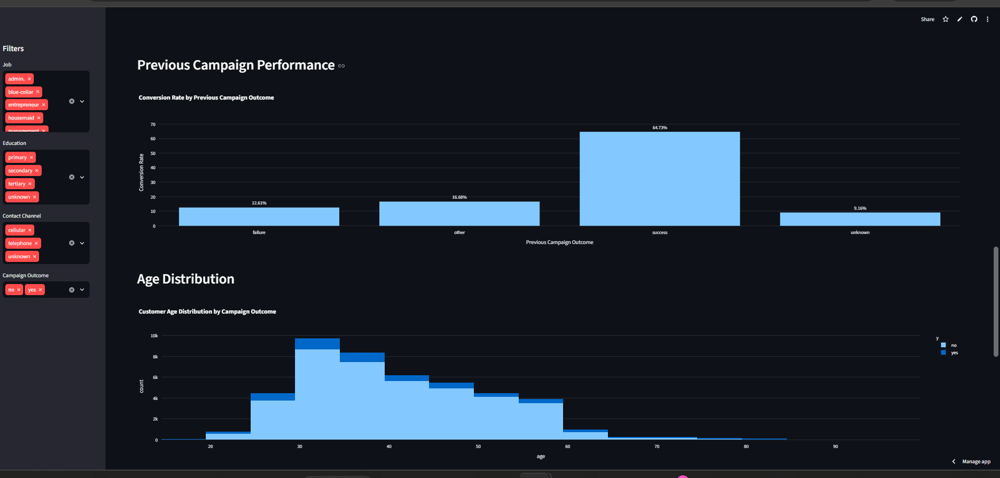
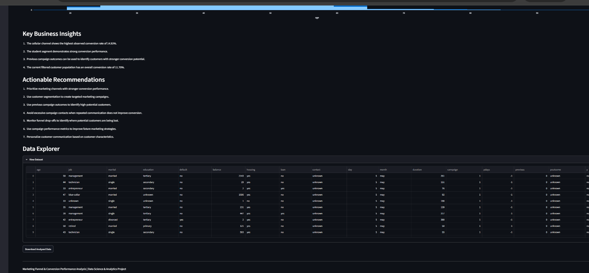

# Marketing Funnel & Conversion Performance Analysis

An interactive data analytics project focused on analyzing marketing funnel performance, customer conversion patterns, campaign effectiveness, contact channel performance, and opportunities to improve lead-to-customer conversion.

Built using Python, Pandas, NumPy, Matplotlib, Seaborn, Plotly, and Streamlit.

---

## 🔗 Project Links

**GitHub Repository:**  
https://github.com/Naina137/Marketing-Funnel-and-Conversion-Performance-Analysis

**Live Streamlit Dashboard:**  
https://marketing-funnel-and-conversion-performance-analysis-ymxdoixnv.streamlit.app/

**LinkedIn:**  
https://www.linkedin.com/in/naina-kumari-06373132b

---

## 📌 Project Overview

Marketing funnel analysis helps businesses understand how potential customers move through different stages of the customer journey and where opportunities are lost before conversion.

This project analyzes the **Bank Marketing Dataset** to understand:

- Customer response patterns
- Marketing campaign performance
- Conversion behavior
- Contact channel performance
- Customer segments
- Previous campaign outcomes
- Funnel progression and potential drop-offs

The final deliverable is an interactive **Streamlit dashboard** that converts raw marketing data into meaningful visual insights and actionable business recommendations.

---

## 🎯 Task 3: Marketing Funnel & Conversion Performance Analysis

### Task Objective

The objective of this task is to analyze marketing funnel data to identify:

- Conversion drop-off points
- Funnel performance
- Channel performance
- Campaign performance
- Customer response patterns
- Conversion-related factors
- High-performing customer segments
- Opportunities to improve lead-to-customer conversion

### Deliverable

An interactive funnel performance dashboard containing:

- Conversion analysis
- Funnel visualization
- Campaign analysis
- Customer segmentation
- Channel performance
- Key insights
- Actionable recommendations

---

## ❓ Problem Statement

Businesses generate large amounts of marketing and customer data, but raw data alone does not provide clear business direction.

This project focuses on answering questions such as:

- Where are customers dropping out of the marketing funnel?
- Which contact channels perform better?
- How does campaign frequency relate to conversion?
- Which customer segments show stronger conversion potential?
- How do previous campaign outcomes relate to current conversion?
- How can marketing campaigns be optimized to improve conversions?

---

## 🎯 Project Objectives

- Analyze marketing funnel performance
- Calculate important conversion metrics
- Identify conversion patterns
- Analyze campaign performance
- Compare contact channel performance
- Study customer segments
- Analyze previous campaign outcomes
- Identify potential funnel drop-offs
- Generate meaningful business insights
- Provide actionable recommendations

---

## 🛠️ Technologies & Tools

| Technology | Purpose |
|------------|---------|
| Python | Data analysis and application development |
| Pandas | Data cleaning, transformation and analysis |
| NumPy | Numerical operations |
| Matplotlib | Data visualization |
| Seaborn | Statistical visualization |
| Plotly | Interactive visualizations |
| Streamlit | Interactive dashboard |
| Git | Version control |
| GitHub | Repository hosting |

---

## 📊 Dataset

This project uses the **Bank Marketing Dataset**, primarily the `bank-full.csv` dataset.

The dataset contains customer and marketing campaign information including:

- Age
- Job
- Education
- Marital status
- Financial attributes
- Housing loan
- Personal loan
- Contact method
- Campaign contacts
- Previous campaign outcome
- Customer response

### Dataset Files

```text
bank-full.csv
bank.csv
bank-names.txt
```

---

## 🔄 Data Analysis Workflow

```text
Bank Marketing Dataset
        ↓
Data Loading
        ↓
Data Cleaning & Preparation
        ↓
Exploratory Data Analysis
        ↓
Marketing Funnel Analysis
        ↓
Conversion Analysis
        ↓
Campaign Performance Analysis
        ↓
Customer Segment Analysis
        ↓
Channel Performance Analysis
        ↓
Key Insights
        ↓
Business Recommendations
        ↓
Interactive Streamlit Dashboard
```

---

## 🧹 Data Preparation

The analysis follows a structured data preparation process:

1. Load the dataset
2. Inspect dataset structure and variables
3. Check data quality
4. Remove duplicate records
5. Clean categorical variables
6. Prepare data for analysis
7. Create conversion-related metrics
8. Calculate funnel performance
9. Analyze campaign and customer segments
10. Generate visualizations
11. Identify business insights
12. Present results through Streamlit

---

# 📈 Analysis Performed

## 1. Marketing Funnel Analysis

The funnel analysis examines customer progression from the overall customer population through contact and eventual conversion.

It helps identify:

- Total customers
- Contacted customers
- Converted customers
- Conversion rate
- Funnel progression
- Potential conversion drop-offs

### Funnel Analysis


---

## 2. Conversion Analysis

Conversion analysis evaluates customer outcomes and identifies patterns associated with successful conversion.

The analysis includes:

- Converted vs non-converted customers
- Overall conversion rate
- Conversion rate by contact channel
- Conversion rate by customer segment
- Conversion rate by education
- Conversion rate by previous campaign outcome

### Conversion Analysis



---

## 3. Campaign Performance Analysis

Campaign-related variables are analyzed to understand how marketing activity relates to customer conversion.

The analysis examines:

- Number of campaign contacts
- Customer distribution by campaign contacts
- Conversion rate by campaign contacts
- Previous campaign outcomes
- Relationship between previous outcomes and current conversion

### Campaign Analysis


---

## 4. Customer Segment Analysis

Customer characteristics are analyzed to understand differences in conversion behavior across customer groups.

The analysis considers:

- Age
- Job
- Education
- Marital status
- Housing loan status
- Personal loan status
- Customer response

This helps identify customer groups that may have stronger conversion potential.

---

## 5. Contact Channel Analysis

Different communication channels are compared to understand their relative conversion performance.

The analysis helps identify:

- Customer distribution by channel
- Conversion rate by channel
- Better-performing communication channels
- Opportunities for channel optimization

---

## 6. Previous Campaign Analysis

Previous campaign outcomes are analyzed to understand whether historical customer responses provide useful information for future marketing decisions.

This analysis compares previous campaign outcomes with current customer conversion and helps identify potentially high-potential customer groups.

---

# 📌 Key Performance Indicators

The dashboard focuses on important marketing performance metrics such as:

- Total Leads
- Contacted Customers
- Converted Customers
- Conversion Rate
- Contact Rate
- Campaign Performance
- Customer Response

These KPIs provide a quick overview of marketing funnel performance.

---

# 📊 Dashboard Features

The interactive Streamlit dashboard provides:

- Marketing Funnel Analysis
- Conversion Performance Analysis
- Campaign Performance Analysis
- Customer Segmentation
- Contact Channel Analysis
- Previous Campaign Analysis
- KPI Metrics
- Interactive Charts
- Business Insights
- Actionable Recommendations
- Data Exploration
- Downloadable Analyzed Data

---

# 🖥️ Dashboard Preview

## Interactive Dashboard


The dashboard brings the complete analysis together into an interactive interface.

---

## Key Insights & Recommendations



This section summarizes important findings and translates analytical results into actionable business recommendations.

---

# 💡 Key Insights

The analysis provides insights into:

- Marketing funnel progression
- Customer conversion behavior
- Campaign response patterns
- Contact channel performance
- Customer segment performance
- Previous campaign influence
- Potential conversion drop-off areas

The interactive dashboard allows these patterns to be explored from different customer and campaign perspectives.

---

# 💼 Business Recommendations

### 1. Improve Funnel Conversion

Identify stages with significant customer drop-offs and optimize the corresponding marketing or engagement process.

### 2. Focus on High-Potential Segments

Prioritize customer groups that demonstrate stronger conversion potential and develop targeted campaigns for them.

### 3. Optimize Campaign Frequency

Monitor campaign contact frequency and avoid excessive communication when repeated contacts do not improve conversion.

### 4. Improve Channel Selection

Use channel-level conversion performance to prioritize communication methods that generate stronger customer responses.

### 5. Use Previous Campaign Data

Historical campaign outcomes can help identify customers with potentially higher engagement or conversion potential.

### 6. Personalize Marketing Campaigns

Customer characteristics such as age, job, education, marital status, and financial attributes can support more targeted campaigns.

### 7. Monitor Conversion KPIs

Track conversion rate, contacted customers, converted customers, and funnel drop-offs regularly.

---

# 📁 Project Structure

```text
Marketing-Funnel-and-Conversion-Performance-Analysis/
│
├── app.py
├── bank+marketing/
│   └── bank/
│       ├── bank.csv
│       ├── bank-full.csv
│       └── bank-names.txt
│
├── bank-full.csv
├── Funnel-Analysis.png
├── campaign-analysis.png
├── confusion-analysis.png
├── dashboard.png
├── KeyInsights-recommendatins.png
├── requirements.txt
└── README.md
```

---

# ⚙️ How to Run Locally

### 1. Clone the repository

```bash
git clone https://github.com/Naina137/Marketing-Funnel-and-Conversion-Performance-Analysis.git
```

### 2. Navigate to the project directory

```bash
cd Marketing-Funnel-and-Conversion-Performance-Analysis
```

### 3. Install dependencies

```bash
pip install -r requirements.txt
```

### 4. Run the Streamlit dashboard

```bash
streamlit run app.py
```

The application will open in your default browser.

If it does not open automatically, visit:

```text
http://localhost:8501
```

---

# 📦 Requirements

The project uses:

```text
Python 3.x
Pandas
NumPy
Matplotlib
Seaborn
Plotly
Streamlit
```

All required dependencies are listed in:

```text
requirements.txt
```

---

# 🚀 Deployment

The dashboard is deployed using **Streamlit Community Cloud**.

### Live Application

https://marketing-funnel-and-conversion-performance-analysis-ymxdoixnv.streamlit.app/

### GitHub Repository

https://github.com/Naina137/Marketing-Funnel-and-Conversion-Performance-Analysis

---

# 📈 Business Value

This project demonstrates how raw marketing data can be transformed into actionable business intelligence.

The analysis can help businesses:

- Understand customer behavior
- Monitor marketing performance
- Identify conversion bottlenecks
- Compare campaign outcomes
- Identify high-potential customer segments
- Optimize marketing channels
- Improve campaign targeting
- Support data-driven decision making

---

# 🔮 Future Improvements

The project can be further enhanced with:

- Machine Learning-based conversion prediction
- Advanced customer segmentation
- Customer Lifetime Value analysis
- Campaign performance forecasting
- Predictive customer targeting
- Advanced interactive filters
- Automated business reports
- Real-time marketing performance monitoring
- Advanced KPI tracking

---

# 🧠 Skills Demonstrated

- Data Cleaning
- Exploratory Data Analysis
- Data Visualization
- Marketing Analytics
- Funnel Analysis
- Conversion Analysis
- Campaign Performance Analysis
- Customer Segmentation
- KPI Analysis
- Business Intelligence
- Python
- Pandas
- NumPy
- Matplotlib
- Seaborn
- Plotly
- Streamlit
- Git
- GitHub
- Data-driven Problem Solving

---

# 🎓 Internship Task

**Future Interns — Data Science & Analytics Internship**

**Task 3:** Marketing Funnel & Conversion Performance Analysis

This project was developed as part of the internship task to apply practical data analytics skills to a real-world marketing scenario.

The project focuses on funnel analysis, conversion metrics, campaign performance, customer behavior, visualization, insight generation, and actionable business recommendations.

---

# 👩‍💻 Author

## Naina Kumari

**Computer Science & Engineering — Data Science**

Interested in Data Science, Data Analytics, Machine Learning, Business Intelligence, and building practical data-driven applications.

---

# 🔗 Connect With Me

**GitHub:**  
https://github.com/Naina137

**LinkedIn:**  
https://www.linkedin.com/in/naina-kumari-06373132b

---

⭐ If you find this project useful, feel free to explore the repository and the interactive dashboard.
